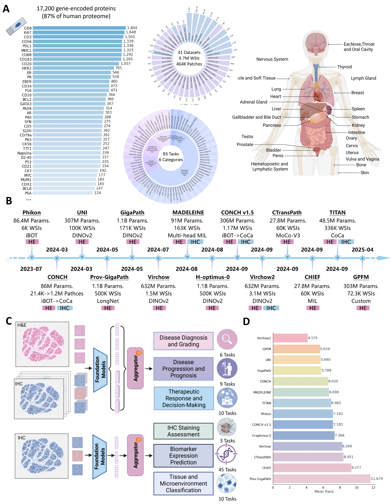

# ImmunoBench: A Benchmark for Immunohistochemistry-based Prediction Tasks

\[ [Paper (Coming Soon)]() | [Features on HuggingFace](https://huggingface.co/datasets/AI4Pathology/ImmunoBench-image-features) \]

Official repository for **ImmunoBench**, a benchmark for evaluating pathology foundation models on immunohistochemistry (IHC)-based clinical prediction tasks.

<p align="center">
  
</p>

## Overview

ImmunoBench provides:
- Pre-extracted features from pathology foundation models
- Multiple clinical prediction tasks, including survival and recurrence
- Three input settings: `HE_Only`, `IHCs_Only`, and `Multi_Stain`
- Training scripts and CSV files for direct benchmarking

## Installation

```bash
git clone https://github.com/YOUR_USERNAME/immune_bench.git
cd immune_bench
conda create -n immunobench python=3.9
conda activate immunobench
pip install -r requirements.txt
```

## Dataset

Features are hosted on HuggingFace:
- Dataset: [AI4Pathology/ImmunoBench-image-features](https://huggingface.co/datasets/AI4Pathology/ImmunoBench-image-features)

Top-level folders are organized by task:

```text
ImmunoBench-image-features/
├── HANCOCK_Chemotherapy_DSS/
├── HANCOCK_Chemotherapy_OS/
├── HANCOCK_Chemotherapy_Recurrence/
├── HANCOCK_Radiotherapy_DSS/
├── HANCOCK_Radiotherapy_OS/
├── HANCOCK_Radiotherapy_Recurrence/
├── HANCOCK_Surgery_DSS/
├── HANCOCK_Surgery_OS/
└── HANCOCK_Surgery_Recurrence/
```

Each task contains three modality folders:
- `HE_Only`: H&E features only
- `IHCs_Only`: IHC features only
- `Multi_Stain`: combined H&E and IHC features

Within each modality, features are grouped by backbone, for example `virchow`, `virchow2`, `gigapath_wsi`, `uni`, and `conch`.

### CSV and Modality Mapping

The repository already includes CSV files and training scripts for all three modality settings:

| CSV suffix | Modality | HuggingFace folder | Script suffix |
| --- | --- | --- | --- |
| none | Multi-stain | `Multi_Stain/` | none |
| `_HE` | H&E only | `HE_Only/` | `_HE` |
| `_IHC` | IHC only | `IHCs_Only/` | `_IHC` |

Examples:
- `HANCOCK_Chemotherapy_OS_survival.csv` -> `Multi_Stain/` -> `survival_HANCOCK_Chemotherapy_OS.sh`
- `HANCOCK_Chemotherapy_OS_survival_HE.csv` -> `HE_Only/` -> `survival_HANCOCK_Chemotherapy_OS_HE.sh`
- `HANCOCK_Chemotherapy_OS_survival_IHC.csv` -> `IHCs_Only/` -> `survival_HANCOCK_Chemotherapy_OS_IHC.sh`

## Quick Example

The minimal workflow is:
1. Download features for one task
2. Replace the old feature prefix in `dataset_csv/`
3. Run the matching training script

### 1. Download one task

Using the HuggingFace Python API:

```python
from huggingface_hub import snapshot_download

snapshot_download(
    repo_id="AI4Pathology/ImmunoBench-image-features",
    repo_type="dataset",
    local_dir="./features",
    allow_patterns="HANCOCK_Chemotherapy_OS/**"
)
```

Or use the helper script:

```bash
python download_features.py \
  --task HANCOCK_Chemotherapy_OS \
  --output_dir ./features
```

### 2. Replace the old feature prefix in `dataset_csv/`

After downloading, edit the `dir` column in `dataset_csv/*.csv` so that the old absolute prefix points to the local `features/` directory.

For example, replace:

```text
/tmp/hceph_2_8703576/yanfang/IHC_Benchmarks/data/features_concat_IHCs_only/HANCOCK_Chemotherapy_OS
```

with:

```text
features/HANCOCK_Chemotherapy_OS/IHCs_Only
```

and similarly:
- `features/HANCOCK_Chemotherapy_OS/Multi_Stain`
- `features/HANCOCK_Chemotherapy_OS/HE_Only`

### 3. Run training

```bash
cd train_scripts

bash survival_HANCOCK_Chemotherapy_OS.sh
# or
bash survival_HANCOCK_Chemotherapy_OS_HE.sh
# or
bash survival_HANCOCK_Chemotherapy_OS_IHC.sh
```

Results are written under `results/experiments/train/splits712/`, and logs are written under `logs/`.

## More Download Options

You can download a specific modality:

```bash
python download_features.py \
  --task HANCOCK_Chemotherapy_OS \
  --modality Multi_Stain \
  --output_dir ./features
```

You can also download selected backbones only:

```bash
python download_features.py \
  --task HANCOCK_Chemotherapy_OS \
  --modality Multi_Stain \
  --models virchow2 uni \
  --output_dir ./features
```

## Training Notes

- Survival tasks use scripts named `survival_*.sh`
- Recurrence tasks use scripts named `subtype_*.sh`
- Most settings can be changed by editing variables at the top of each script

Common customizations:

```bash
backbones="virchow virchow2"
CUDA_VISIBLE_DEVICES=1 bash survival_HANCOCK_Chemotherapy_OS.sh
```

## Available Tasks

| Task type | Example task | Prediction target |
| --- | --- | --- |
| Survival | `HANCOCK_Chemotherapy_OS` | overall survival |
| Survival | `HANCOCK_Chemotherapy_DSS` | disease-specific survival |
| Recurrence | `HANCOCK_Chemotherapy_Recurrence` | recurrence |

Parallel task sets are also provided for Radiotherapy and Surgery cohorts.

## Available Backbones

ImmunoBench includes features from multiple pathology foundation models, including:
- `virchow`, `virchow2`
- `uni`, `uni2-h`
- `h_optimus_0`, `h_optimus_1`
- `gigapath`, `gigapath_wsi`
- `conch`, `conch_v1_5`
- `phikon`, `phikon-v2`
- `ctranspath`, `gpfm`, `chief`

## Repository Layout

```text
immune_bench/
├── train_scripts/      # task-specific training entrypoints
├── dataset_csv/        # CSV files with labels and feature directories
├── splits712/          # predefined data splits
├── datasets/           # dataset loaders
├── mil_models/         # MIL model implementations
├── utils/              # helper scripts
├── main.py             # main training entrypoint
└── download_features.py
```

## Support

- Code or training issues: open a GitHub issue
- Dataset or feature questions: contact the repository maintainers

## License

This project is released under the license provided with the repository.
